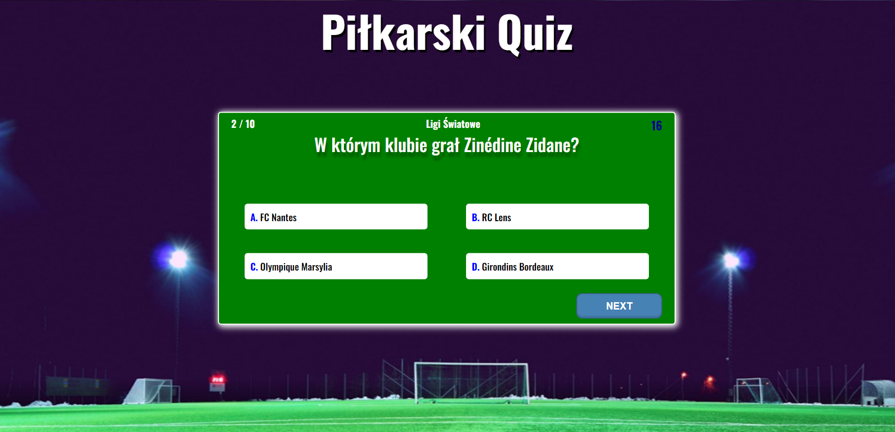

# Football Quiz
Live demo: https://krzykerlin.github.io/Football-Quiz/

 

## Opis / Description
Autorski pomysł - wykonany w ramach ćwiczeń. Za całą interakcję aplikacji odpowiada JavaScript. 
Responsywność (breakpointy) ustawione na: 576px, 768px, 992px oraz 1200px - mobile first.

Football quiz that's my original idea - created as a part of the training project. JavaScript is responsible for all application interaction. Breakpoints are set to: 576px, 768px, 992px and 1200px - mobile first.

## Zasady / Rules
Quiz piłkarski podzielony na 4 różne kategorie i w każdej z nich znajduje się 10 pytań. Na każde pytanie jest 20 sekund czasu na odpowiedź. Po kliknięciu odpowiedzi czas się zatrzymuje i nie można już zmienić decyzji. W przypadku wybrania złej odpowiedzi pokazuje się poprawna odpowiedź (podświetlona na zielono). Za każdą poprawną odpowiedź przydzielony jest 1 punkt. Maksymalna liczba punktów to: 10.

Football quiz divided into 4 different categories and in each category there are 10 questions. There is 20 seconds of time to answer each question. Once you click an answer, the time stops and you can no longer change your decision. If you choose the wrong answer, the correct answer is shown (highlighted in green). For each correct answer 1 point is assigned. The maximum number of points is: 10.

## Technologie / Technologies
 
